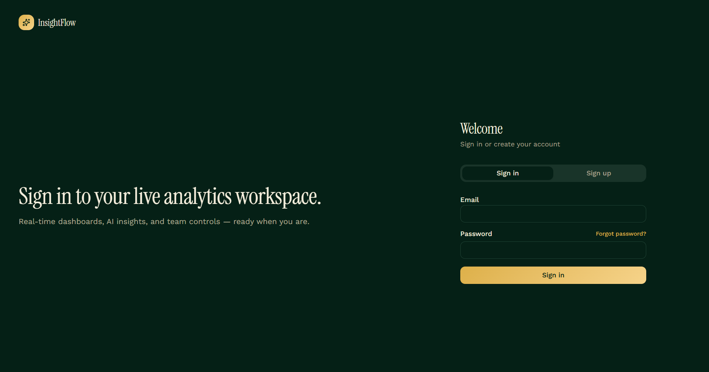
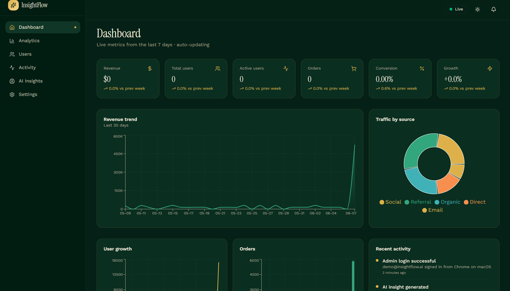
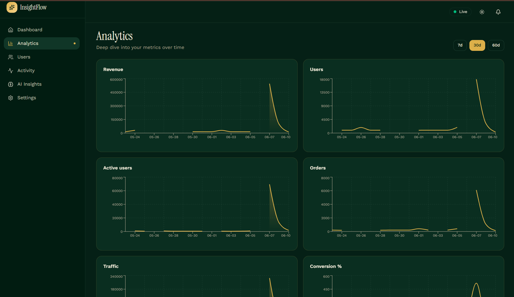
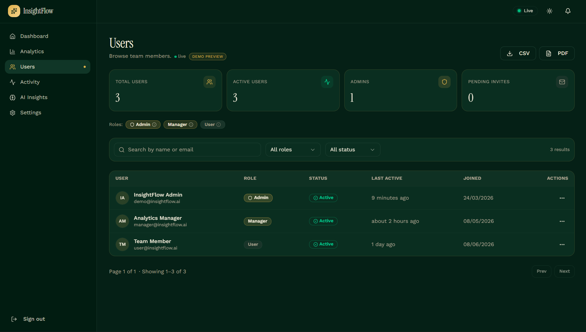
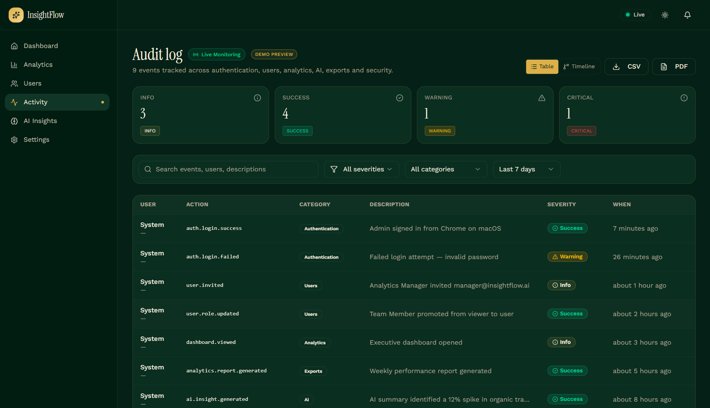
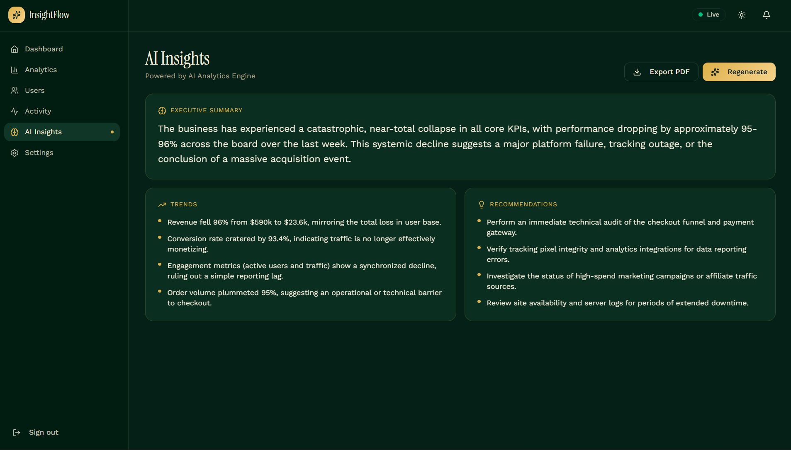

# InsightFlow — Real-Time AI Analytics Dashboard

AI-powered real-time business intelligence platform. Live metrics, instant AI summaries, role-based access, and an enterprise-grade audit log — built as a portfolio-grade production SaaS application.

## Overview

InsightFlow is a full-stack analytics workspace that streams metrics in real time, surfaces trends and anomalies through an AI analytics engine, and gives administrators fine-grained control over users and activity. It's designed to look and behave like a real product — not a demo.

## Project Scope

InsightFlow converts raw business data into structured analytics, AI-generated insights, and actionable decisions. Operational events stream into a Postgres warehouse in real time, are aggregated into KPIs and trend charts, and then summarized by an AI layer that produces executive summaries, anomaly callouts, and recommendations. Administrators get an enterprise-grade audit log and role-based access control on top, so a single workspace can safely serve leadership, operators, and read-only stakeholders.

## Problem Statement

Modern operations teams juggle a dozen disconnected dashboards and rarely have a single trusted view of *what is happening right now* and *who did what*. Existing BI tools are powerful but slow to set up, lack real-time signals, hide audit data, and expose no AI summary layer for non-technical stakeholders. InsightFlow solves this by combining:

* live KPI streaming so leadership sees movement the moment it happens,
* an AI insights layer that turns raw metrics into plain-language recommendations,
* an enterprise-grade audit log with severity, category and device metadata,
* and strict role-based access so the same workspace can safely host admins, managers and read-only viewers.


## Features

* **Real-time dashboard** — KPI cards, sparklines, and a live event feed that updates the moment new data arrives.
* **Deep analytics** — Trend charts, segment breakdowns, and time-range filters powered by Recharts.
* **AI Insights** — Executive summary, trend detection, and recommendations generated on demand, with PDF export.
* **User management** — Avatars, roles, status, last active, action menu (view, edit, change role, block, delete), pagination, filters, and CSV/PDF export.
* **Enterprise audit log** — Severity levels, device \& metadata details drawer, date and severity filters, exportable reports.
* **Authentication** — Email + password and 6-digit OTP verification on signup; passwordless email OTP sign-in.
* **Role-based access control (RBAC)** — `admin`, `manager`, `user` enforced via a dedicated `user\_roles` table and a `has\_role()` security-definer function.
* **Row-level security (RLS)** — Policies on every public table; admin operations route through a server-only admin client.
* **Realtime status indicator** — Live / connecting / offline pill in the app header.
* **Notifications** — In-app bell with realtime updates, welcome notification on signup.
* **Theme switching** — Light / dark with Emerald Prestige palette and gold accents.
* **Exports** — CSV and PDF reports across users, activity, and AI insights.

## Tech Stack

**Frontend**: React 19, TypeScript, TanStack Start (Vite 7), TanStack Router, TanStack Query, Tailwind CSS v4, ShadCN UI, Framer Motion, Recharts, Zod, Sonner, jsPDF.

**Backend**: PostgreSQL with Row Level Security, Auth, Realtime, Storage — accessed through TanStack Start server functions (`createServerFn`) and a service-role admin client for trusted writes.

**AI**: AI Analytics Engine (Gemini-class model via a server-side gateway). All keys stay server-side.

**Runtime**: Cloudflare Workers (edge) via TanStack Start, with `nodejs\_compat`.

## Architecture

```
┌──────────────────────────────────────────────────────┐
│  React UI (TanStack Router + Query + Tailwind)       │
│  ─ Public landing (SSR)                              │
│  ─ /\_authenticated/\* protected subtree               │
└──────────────────────────────────────────────────────┘
                       │
                       │  serverFn RPC (Bearer auth attached automatically)
                       ▼
┌──────────────────────────────────────────────────────┐
│  TanStack Start Server (Cloudflare Workers)          │
│  ─ requireSupabaseAuth middleware (user-scoped)      │
│  ─ supabaseAdmin (service role, server-only)         │
│  ─ AI gateway calls for /insights                    │
└──────────────────────────────────────────────────────┘
                       │
                       ▼
┌──────────────────────────────────────────────────────┐
│  Postgres + Auth + Realtime + Storage                │
│  ─ profiles, user\_roles, activities, analytics,      │
│    notifications, reports                            │
│  ─ RLS policies + has\_role() security-definer fn     │
│  ─ supabase\_realtime publication on key tables       │
└──────────────────────────────────────────────────────┘
```

Source layout:

```
src/
├── components/        # UI, layout (sidebar, realtime status, notifications)
├── hooks/             # use-simulate-tick, etc.
├── integrations/
│   └── supabase/      # browser client, admin client, auth middleware
├── lib/               # \*.functions.ts (server functions), helpers
├── routes/
│   ├── \_\_root.tsx     # shell + global auth listener
│   ├── index.tsx      # landing
│   ├── auth.tsx       # sign in / sign up / email OTP
│   ├── verify-email.tsx
│   └── \_authenticated/
│       ├── route.tsx  # auth gate (ssr: false)
│       ├── dashboard.tsx
│       ├── analytics.tsx
│       ├── users.tsx
│       ├── activities.tsx
│       ├── insights.tsx
│       └── settings.tsx
└── styles.css         # design tokens (Emerald Prestige + gold)
supabase/migrations/   # schema, RLS, grants, realtime publication
```

## Setup

Prerequisites: num (or Node 20+), and a Postgres-backed cloud project with Auth \& Realtime.

```bash
num install
num run dev
```

Required environment variables (`.env`):

```
# Client (safe to expose)
VITE\_SUPABASE\_URL=...
VITE\_SUPABASE\_PUBLISHABLE\_KEY=...
VITE\_SUPABASE\_PROJECT\_ID=...

# Server-only
SUPABASE\_URL=...
SUPABASE\_PUBLISHABLE\_KEY=...
SUPABASE\_SERVICE\_ROLE\_KEY=...    # bypasses RLS — server only
AI\_API\_KEY=...              # AI gateway key for /insights
```

The migration set under `supabase/migrations/` creates all tables, policies, grants, the `handle\_new\_user` trigger, and enables Realtime on `profiles`, `activities`, `analytics`, and `notifications`.

## Demo Account

A dedicated demo account is available for recruiter / project evaluation:

|Field|Value|
|-|-|
|Email|`demo@insightflow.ai`|
|Password|`InsightFlow@2026Secure!`|
|Role|Admin|

> \*\*Note:\*\* This account is provided solely for portfolio review and recruiter assessment. Please do not use it for production data or store sensitive information inside it.

## Role-Based Access Control (RBAC)

InsightFlow ships three first-class roles, stored in a dedicated `user\_roles` table (never on `profiles`) and enforced both at the API layer and inside Postgres RLS via a `has\_role(uid, role)` `SECURITY DEFINER` function.

|Role|Scope|
|-|-|
|`admin`|Full management — users, role changes, audit log, exports, AI insights, settings.|
|`manager`|Analytics and operational access — dashboards, analytics, AI insights, exports.|
|`user`|Read-only — dashboards and personal settings.|

The first account that signs up is automatically promoted to `admin`. Role changes are themselves audited and emitted into the activity log in real time.

## Screenshots

### Authentication



### Dashboard



### Analytics



### Users



### Activities



### AI Insights




## Deployment

The app builds and deploys as a single TanStack Start bundle on Cloudflare Workers (edge). Publishing from the editor pushes the latest build to:

* Production: `Your deployed application URL`
* Preview: `Your preview deployment URL`

Steps:

1. Ensure all migrations are applied.
2. Confirm secrets are set (`SUPABASE\_SERVICE\_ROLE\_KEY`, `Gemini\_API\_KEY`).
3. Publish from the editor — the worker route, static assets, and server functions deploy together.
4. The first signed-up account automatically becomes the workspace admin.

## Future Improvements

* **Org \& team workspaces** — multi-tenant scoping with per-team RBAC and billing.
* **Custom dashboards** — drag-and-drop widgets with saved views per user.
* **Webhooks \& integrations** — push activity events to Slack, PagerDuty, and customer-owned endpoints.
* **Anomaly detection** — server-side ML pipeline that surfaces anomalies directly into the AI insights panel.
* **Granular permissions** — resource-level ACLs beyond the three base roles.
* **SSO / SAML** — enterprise sign-in and SCIM provisioning.
* **Mobile companion app** — read-only dashboards and push alerts for on-call leadership.
* **Scheduled reports** — recurring PDF/CSV email digests for stakeholders.


## Security Notes

* Roles are stored in a dedicated `user\_roles` table — never on `profiles` — to prevent privilege escalation.
* `has\_role(uid, role)` is `SECURITY DEFINER` with a fixed `search\_path` and is used inside RLS policies.
* Service-role client is imported only inside server function handlers (`await import(...)`) so it never leaks into client bundles.
* The protected route subtree (`/\_authenticated/\*`) uses `ssr: false` and a client-side gate; every server function is independently re-authorized via bearer token.

\---

AI-powered real-time business intelligence platform.
© 2026 InsightFlow. All rights reserved.

